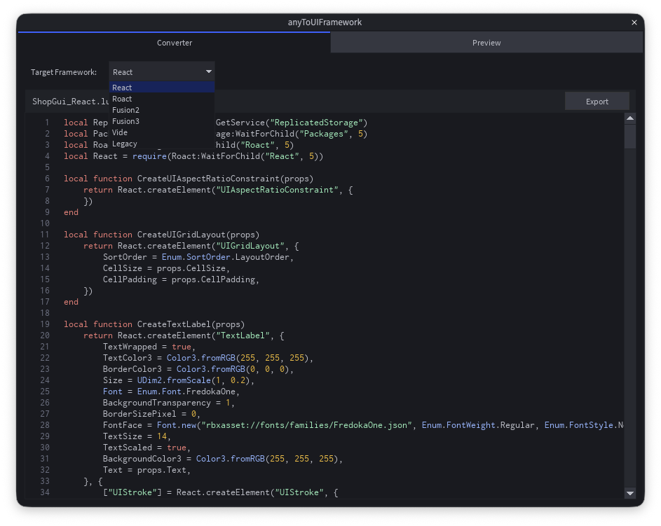
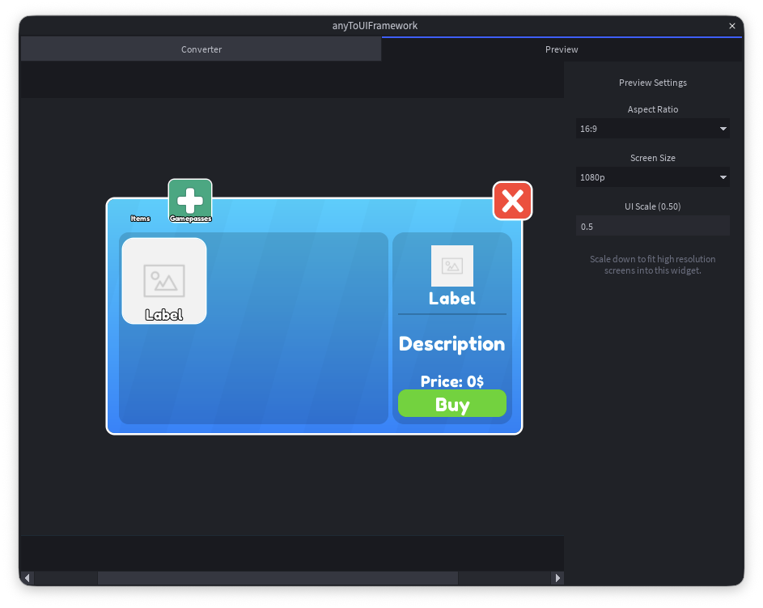

# anyToUIFramework

anyToUIFramework is a powerful Roblox Studio plugin designed to streamline the UI development process. It allows developers to seamlessly convert selected UI elements in Roblox Studio into clean, reactive code using modern UI frameworks.

## Features

- Converts Roblox UI instances into high-quality, readable code.
- Supports multiple reactive UI paradigms:
  - Roblox React (Roact)
  - Elttob Fusion
  - Vide
  - Legacy (Vanilla instance creation)
- Editor-only execution to ensure zero runtime overhead.
- Highly modular and optimized code generation.

## Preview

### Code Conversion

### UI Preview

## Installation

You can install the plugin directly from the Roblox Creator Store or download the latest release from GitHub.

- **Roblox Creator Store:** [Get anyToUIFramework](https://create.roblox.com/store/asset/128532514717056/anyToUIFramework)
- **GitHub Releases:** [Download Latest Release](https://github.com/lolipop345/anyToUIFramework/releases)

## Usage

1. Open Roblox Studio and navigate to the Plugins tab.
2. Click on the anyToUIFramework button to open the widget.
3. Select any UI element (Frame, TextLabel, ImageButton, etc.) in your Explorer.
4. Choose your preferred framework (Roact, Fusion, Vide, or Legacy).
5. The generated code will appear in the preview window, ready to be copied into your scripts.
